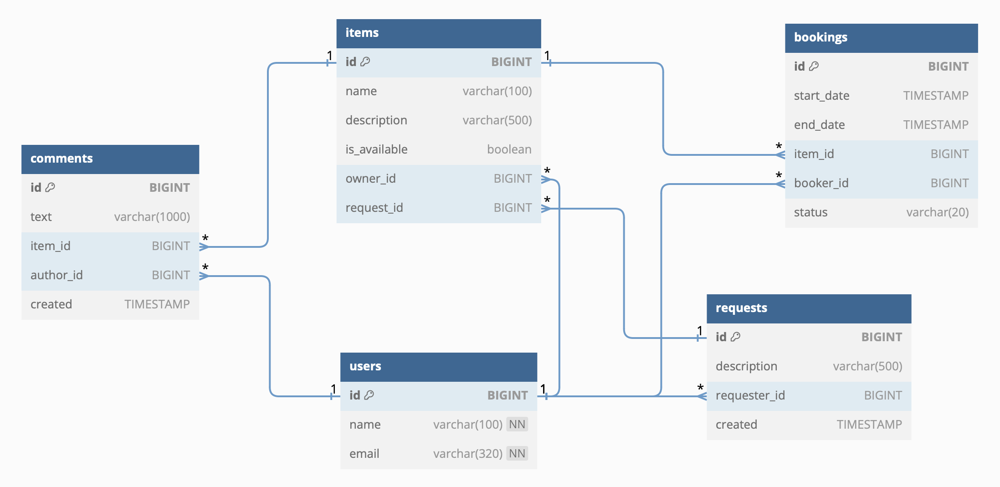

# JAVA-SHAREIT

API service with microservice architecture for sharing things. Provides users, firstly, with the opportunity to tell what things they are willing to share, and secondly, to find the right thing and rent it for some time.
The service not only allows you to book an item for certain dates, but also blocks access to it from others during the booking period. In case the required item is not available on the service, users have the opportunity to leave requests. Upon request, it will be possible to add new items for sharing.

Technologies: 
* Java 11
* Spring Boot
* Spring Data, Hibernate
* PostgreSQL, SQL
* Maven
* Docker
* Postman
* Lombok

---
### DATABASE STRUCTURE ER-DIAGRAM

---
### REQUEST EXAMPLES FOR BASIC OPERATIONS

| method | path                    | purpose                                                                                             |
|--------|-------------------------|-----------------------------------------------------------------------------------------------------|
| POST   | /users                  | add new user                                                                                        |
| GET    | /users/{id}             | get user with specified **_{id}_**                                                                  |
| PATCH  | /users/{id}             | update user with specified **_{id}_**                                                               |
| DELETE | /users/{id}             | delete user with specified **_{id}_**                                                               |
| GET    | /users                  | get all users                                                                                       |
| POST   | /items                  | add new item                                                                                        |
| GET    | /items/{itemId}         | get item with specified **_{itemId}_**                                                              |
| GET    | /items                  | get items of viewer (user) with **_X_SHARER_USER_ID_** specified in request header                  |
| GET    | /items/search           | get items by search **_text_** specified in request parameter                                       |
| PATCH  | /items/{itemId}         | update item with specified **_{itemId}_**                                                           |
| POST   | /items/{itemId}/comment | add new comment to item with specified **_{itemId}_**                                               |
| POST   | /requests               | add new item request                                                                                |
| GET    | /requests               | get item requests of viewer (user) with **_X_SHARER_USER_ID_** specified in request header          |
| GET    | /requests/{requestId}   | get item request with specified **_{requestId}_**                                                   |
| GET    | /requests/all           | get all item requests                                                                               |
| POST   | /bookings               | add new booking                                                                                     |
| GET    | /bookings/{bookingId}   | get booking with specified **_{bookingId}_**                                                        |
| PATCH  | /bookings/{bookingId}   | update booking with specified **_{bookingId}_**                                                     |
| GET    | /bookings               | get bookings of viewer (user) with **_X_SHARER_USER_ID_** specified in request header               |
| GET    | /bookings/owner         | get bookings of items of viewer (user) with **_X_SHARER_USER_ID_** specified in request header      |

---

### PROJECT RUN

1. mvn package
2. docker-compose up

To test the application, you can use the [Postman collection](postman/sprint.json).